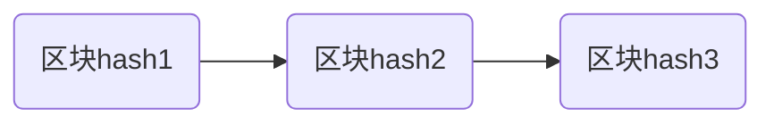

### 区块链区块数据结构
 - 区块所需要的数据概述
 1. 当前区块编号
 2. 区块生成时间戳
 3. 上一个区块的hash值
 4. 当前区块的hash值
 5. 当前区块的数据内容

 <!---more-->
 #### 代码示例(golang)

 ```go
 type Block struct{
     Index int64 //区块编号
     Timestamp int64 //区块时间戳
     PrevBlockHash string  //当前区块哈希值
     Data string //区块数据
 }
 ```
 ----

### 区块链链式结构


1. 除了创世块,其他区块的生成都是根据父区块的hash+当前区块的数据和自增的区块号生成的当前区块hash值
<!--more-->
2. 这保证了数据不被篡改,一旦某个区块的数据发生变化,其hash值也会发生变化,很容易被发现,其他节点也会发现异常,想要改动一个数据则需要改动后续所有的区块

----

### 跨链技术的分析,资产跨链,合约跨链,预言机

- 跨链分为资产(币)跨链,合约跨链 
- 三大跨链技术 闪电网络、侧链和中继
<!--more-->

----
#### 资产跨链

- 本质上币的跨链并没有真实的币从一条链跑到另外一条链，只是币在各自链上相互纠缠一样锁定和解锁的状态
 
币的跨链技术有很多，有双向锚定（two-way-peg），哈希时间锁，原子交换，资产质押转移，网关，联邦签名等等,双向锚定是比特币侧链技术中非常重要的概念,用来实现比特币主链币和侧链币之间的跨链。双向锚定能够让侧链“知道”主链上的特定币是否处于锁定状态，并且依此锁定状态来解锁或销毁对应数量的侧链币。这就好像BTC“跨”到了侧链，或者反过，侧链币“跨”回了主链。

比特股是一个去中心化的交易所，里面可以交易比特币，哎，这里面的比特币是怎么出现的呢？用的就是网关技术。原理很简单，就是用户将比特币发给一个叫“网关”的地方，然后“网关”会生成一个比特币稳定币在比特股流通。用户要提比特币时，就反过来，网关会销毁比特币稳定币，然后将相同数量的比特币发给用户。

币的跨链有一个非常重要的概念叫“原子交换”。所谓的原子交换是指：A链上的一笔交易，和B链上的一笔交易，要么同时成立，要么同时不成立。

比如BTC和LTC，两个人，张三愿意拿1BTC换李四的100LTC，为了防止毁约，双方使用原子交换技术来完成币的互换。

>张三给李四一个LTC地址；李四给张三一个BTC地址。
>
>张三使用原子交换协议构建了一笔BTC交易，将1BTC发到李四的BTC地址。这>笔交易成立的条件是张三的LTC地址收到李四发来的100LTC。
>
>李四使用原子交换协议构建了一笔LTC交易，将100LTC发到张三的LTC地址。>这笔LTC交易成立的条件是李四的BTC地址收到了张三发来的1BTC。
>
>上述两笔交易要么同时成立，要么同时不成立，没有任何一方可以做到在收到>对方的币后，不给币就跑路。

---
#### 合约跨链
以太坊诞生后，区块链开始大量讨论智能合约。智能合约本质上就是代码，这些代码可以依据区块链上的特定数据来触发执行。

智能合约我们可以简化理解成为一个函数，输入特定的参数，代码就会自动触发执行，就能得出特定的结果，并且给出稳定的输出结果
>f(x)=y
>
>f()就是合约代码
>
>x就是激活的代码的条件
>
>y就是合约执行结果。
>
- 合约示例说明
>EOS的众筹就是一个智能合约，这个合约有一个合约地址。
>用户可以将从自己控制私钥的以太坊地址将ETH转入这个合约地址。
>
>EOS的众筹合约每隔23小时就会计算合约地址一共收到多少ETH，并且计算出每个用户的地址将获得多少EOS代币。
>
>过了23小时后，用户就可以向这个合约地址发起一次调用函数，要求合约返回计算好的EOS代币。
>
>这个EOS的众筹合约就会将相应的EOS代币发送到用户的以太坊地址。

---
#### 跨链应用场景
跨链有什么用呢？

第一场景是做去中心化的交易所。依赖币可以跨链，支持用户挂单，通过跨链合约来提供撮合，撮合成交后使用币的跨链来完成币的转移。理论上是可以做到完成不依赖于特定的服务器的。

现在的去中心化交易所，以太坊和EOS上的交易所，并不是严格意义上的跨链去中心化交易所。都是ETH和ERC20之间的交易，和EOS和EOS上的代币的交易。比特股是一个去中心化的交易所，通过网关发行稳定币的方式来将BTC等迁移到BTS内网来交易。

第二个场景是资产抵押。某条链上的币是否解锁，取决于另一条链上的特定信息。

第三个场景是读取链外数据（预言机）的智能合约。比如赌球，有专门的链外数据，即预言机，提供球赛结果。然后用户在以太坊上通过合约来对赌，双方押币进合约，合约采集预言机的特定数据来判决赌资归谁。

----
#### 实现跨链生态
跨链这个概念的提出，会出现两种情况。第一种情况是，在现有链之间相互跨。比如让以太坊和比特币相互跨。第二种情况是，我造一个标准，以后大家按这个标准来设计新的链，所有这些新链就可以非常方便相互跨。

在跨链概念的早期，大家都想着第一种情况。最著名的就是闪电网络，中继和侧链三大技术。这种在现有链相互跨的生态里，是不会发一个叫“跨链币”的币的。跨链技术本生是不会发币。比如闪电网络就不是一种币，只是一种技术。

但在现有的链之间相互跨，因为各自链设计之处就没有考虑过要你跨我我跨你的场景，所以跨链还是很难的。你看侧链，中继，闪电网络等发展了那么多年，你有实际做过跨链吗？没有。

因为早期的链，很多基本上就是复制比特币技术。比如LTC基本上就是复制了BTC。代码都是复制的嘛，所以相互跨就有了理论上的依据。

在第一种情况发展了那么多年后，大家发明，哎呀，这玩意也搞不成啊。然后说，算了算了，看来我们还得想办法搞点别的事。这就诞生了今年的跨链热门。

现在的跨链热门，其实都包含了造链技术。就是我自己设计一条区块链，如cosmos，polkadot，vsystem。这些区块链里都包含了一组造链协议，就是按照特定的标准来设计一条新的链。只要在这个标准下设计出来的链，那相互跨就非常容易了。这些标准协议就是跨链的基础设施。

当然，在第二种情况下，并不是只有新造出来的链能相互跨，他们也会想办法让现有的链也加入到跨链生态中。也就是说，在第二种情况下往往是包含了第一种情况的。其中cosmos和polkadot都是使用类似于中继的技术来实现和现有的链跨。

polkadot就将跨现有的链叫着中继链。原理就是将原有链上的资产通过多重签名来锁定，然后在中继链上发行对应的稳定币。

----

### BTC是如何避免并发和重复问题

- 假设有上面的比特币转账记录，并且交易记录时有效的，比特币客户端通过计算 A 钱包相关的每一笔交易记录的输入（接收 BTC 转账记录）和输出（消费 BTC 转账记录）值来得出 A 钱包所剩可用的比特币数量，如下表格：

|  账户  | 发起交易  |  交易后余额   |
|  ----  | ----   	   |  ----  	 |
| A  	 | +10 BTC	   | 10 BTC  	 |
| A  	 | -10 BTC	   | 0 BTC 		 |
| A  	 | -10 BTC	   | -10 BTC  	 |

1. 两条记录被同一个成功制作新区块的矿工节点接收：由于平均每隔 10 分钟全网才能有一位“矿工”生成一个新区块，这个矿工在接收到两条交易记录的时候，假设记录 2 先接收，记录 3 慢接收，“矿工”根据接收的前后顺序检查这两条交易记录是否有效，用户余额是否足够支持本次的转账交易，很明显，记录 3 作废。
2. 两条交易记录被先后两个不同的区块的矿工节点接收：此时，先接收的交易记录会被添加到新区块中，假设比特币客户端节点验证没问题，然后把区块添加到区块链尾部；慢接收的交易记录矿工在检查该钱包地址在转账余额时（检查余额并不是只在局限在当前的区块的交易记录，而是会检查主链上的其它区块中的记录），发现该钱包地址在上一笔交易之后，余额已经不满足下一笔转账交易，所以慢接收的交易记录作废。
3. 两条交易记录被不同的矿工同时打包进新区块并发送给所有客户端节点：这个情况是当矿工 A 先接收到记录 2，然后才接收到记录 3；矿工 B 先接收到记录 3，然后才接收到记录 2，并且两个矿工都同时计算出随机数，同时将新区块发送给比特币网络上的所有客户端节点，这个时候区块链可能会出现分叉，比特币协议规定，分叉之后最先达到 6 个区块的那个分支，被认定为主链，此时短叉链作废，包括里面的交易记录。

#### 参考文章 
[CSDN-区块链解决分布式储存带来的一致性问题](https://blog.csdn.net/weixin_34292924/article/details/91362477)

### 区块链的共识机制 


#### 区块链项目中主流的共识算法

>工作量证明（POW）
>权益证明（POS）
>股份授权证明（DPOS）
>混合证明机制等。

1. 工作量证明机制（POW）

>POW共识机制由算力决定记账权，按照持有的算力占总算力的百分比来决定获得该次记账权的概率。节点需要不断消耗算力工作，进行哈希计算，以找到期望的随机数。验证节点被称为“矿工”，随机数查找过程称为“挖矿”。“挖矿”有三个重要功能：发行新的货币、维护系统的支付功能、通过算力保障系统安全。

<!--more-->
2. 权益证明（POS）

>POS共识机制由持币数以及持有的时间来决定记账权。持有币数及持有的时间占系统总量的百分比，决定获得该次记账权的概率。

3. 股份授权证明（DPOS）

>DPOS共识机制是一种基于投票选举的共识算法，类似于代议制民主。在POS的基础上，DPOS先选举若干代理人，由代理人验证和记账，代理人之间轮流出块。DPOS相比POS能大幅度提升选举效率，在牺牲一部分去中心化特性的情况下得到性能提升。

4. 混合证明机制

>采用工作量证明机制POW发行新币，采用权益证明机制POS维护网络安全。较典型的就是以太坊采用POW+POS混合共识机制。

#### 各共识机制优缺点对比

1.  工作量证明POW共识机制

- POW共识机制的优点：

>算法简单，节点可自由进入，去中心化程度高；
>
>破解系统需要掌握至少51%的算力，需投入极大的成本，安全性极高；
>
>区块生产者的选择通过节点求解哈希函数实现，整个过程不需要人性的参与。

- POW共识机制的缺点：

>为了保证去中心化，区块的确认时间难以缩短；
>
>扩展性弱，TPS低；
>
>随着确认次数的增加，达成共识的可能性也呈指数级增长。
>
>为了确保交易的安全，一笔交易要在6个新的区块产生后才能在全网得到确认，也就是一个交易的确认延迟时间大概是1小时。这无法满足现实世界中对交易实时性要求很高的应用场景。
>>另一方面POW共识算法带来了硬件设备及能源的大量浪费。随着比特币价值的增长，比特币算力竞赛经历了挖矿，GPU挖矿，FPGA挖矿发展到装满ASIC专用芯片矿机的巨大厂房挖矿的阶段。
>>到今天为止，比特币全网算力从创世区块的约7MH/S增至如今约49.63EH/S，比特币的算例已经增加了7万亿倍。
>>目前使用工作量证明机制POW的代表：比特币、比特币现金、比原链等。

2. 权益证明POS共识机制

- POS共识机制的优点：

>不需要耗费能源和硬件设备；
>
>缩短了区块的产生时间和确认时间，提高了系统效率。

- POS共识机制的缺点：

>实现规则复杂，参杂了很多人为因素，容易产生安全漏洞；
>
>与POW共识机制一样，随着确认次数的增加，达成共识的可能性也呈指数级增长。
>
>POS共识机制的致命弱点在于币龄依赖问题，攻击者在积累长时间币龄后，挖矿的难度大大降低，容易对系统发起双花攻击。

>目前使用工作量证明机制POS的代表：未来币。

3. 股份授权证明DPOS共识机制

- DPOS共识机制的优点：

>不需要耗费能源和硬件设备；
>
>缩短了区块的产生时间和确认时间，提高了系统效率。

>DPOS不需要挖矿，也不需要全节点验证，而是由有限数量的见证节点进行验证，因此简单、高效。

- DPOS共识机制的缺点：

>DPOS被普遍质疑过于中心化；
>
>代理记账节点选举过程中存在巨大的人为操作空间。
>
>目前使用工作量证明机制DPOS的代表：EOS。EOS的21个超级节点和100个备用节点由EOS权益持有者选举产生，区块的生产按21个区块为一轮。在每轮开始的时候会选出21个区块生产者。前20个区块生产者由系统根据网络持币用户的投票数自动生成，最后一名区块生产者根据其得票数按概率生成。

>EOS在区块生成后即进入不可逆状态，因而具有良好的最终性。EOS采用的石墨烯技术理论上能达到百万级别的TPS。同时，由于EOS的记账节点有严格的筛选制度，系统的安全性也很高。

4. 混合证明机制

>目前使用混合证明机制的代表是以太坊：采用工作量证明机制POW发行新币，采用权益证明机制POS维护网络安全，一些交易区块（1%）通过POS保护，其余留在POW。以太坊创始人V神认为POW+POS混合机制能够更快捷，更安全，相比较而言对用户更有利

- 摘自 [一文读懂区块链共识机制](https://www.sohu.com/a/254917168_100107019)


